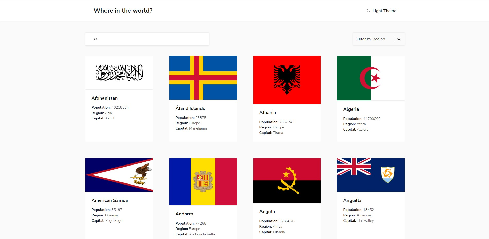
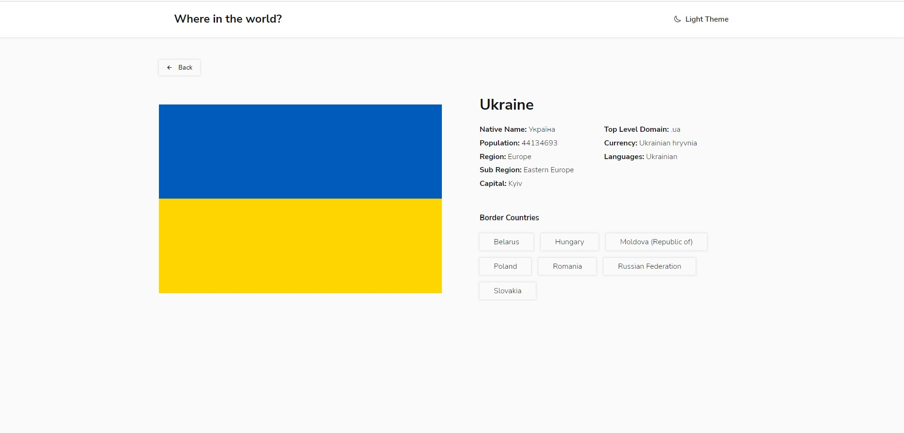

# Countries of the world

## Table of contents

-   [Overview](#overview)
    -   [The challenge](#the-challenge)
    -   [Screenshot](#screenshot)
    -   [Links](#links)
-   [My process](#my-process)
    -   [Built with](#built-with)
    -   [Continued development](#continued-development)
-   [Author](#author)

## Overview

### The challenge

Users should be able to:

-   View the optimal layout for the app depending on their device's screen size
-   Toggle between dark and light modes
-   Search for a specific country by typing a name
-   Filter countries by region
-   View each country page for detailed information
-   Navigate to countries that have a border with the selected country

### Screenshots

### Links

-   Github Repository: https://github.com/Glebkas/countries
-   Live Site URL: https://glebkas.github.io/countries/

## My process

### Built with

-   Semantic HTML5 markup
-   CSS custom properties
-   Flexbox
-   CSS Grid
-   Mobile-first workflow
-   [React](https://reactjs.org/) - JS library
-   [Styled-Components](https://styled-components.com/)
-   [Axios](https://www.npmjs.com/package/axios)
-   [React-route-dom-v6](https://www.npmjs.com/package/react-router-dom)
-   [React-icons](https://www.npmjs.com/package/react-icons)

### Continued development

-   All data transitions should have animations

## Author

Guy Gleb Kasner
